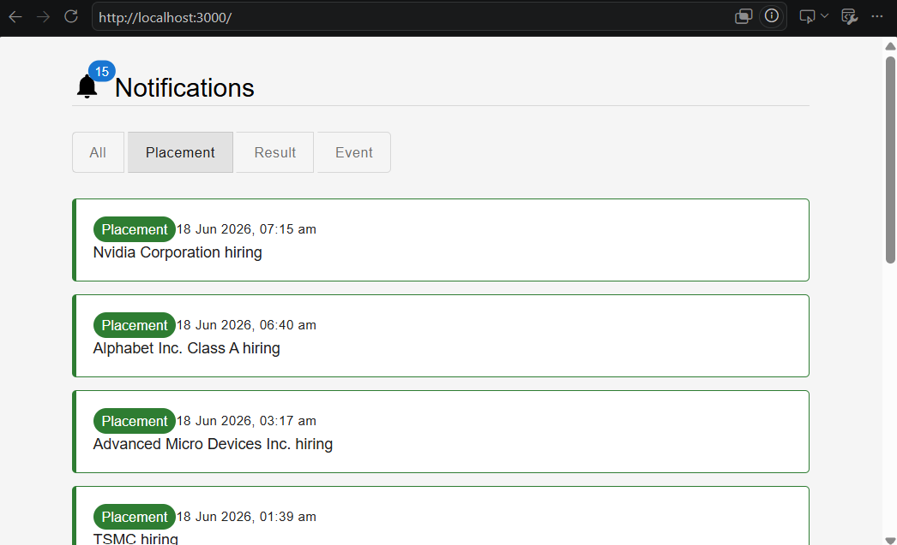
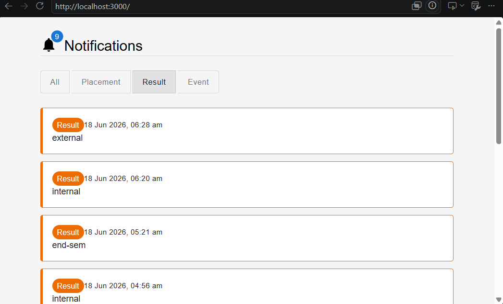
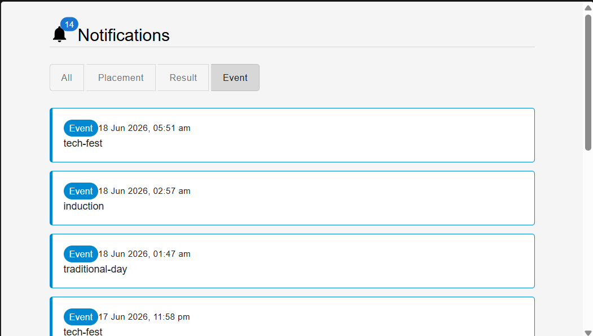

# Notification App - Frontend

This is the frontend for the campus notification system, built as part of the Afford Medical Technologies evaluation.

It pulls notifications from the provided API and shows them in a clean UI with filtering and pagination.

## Screenshots

| Placement | Result | Event |
|:-:|:-:|:-:|
|  |  |  |

## What it does

- Fetches notifications from the evaluation API
- Lets you filter by type — Placement, Result, or Event
- Shows the top 10 notifications sorted by priority (Placement > Result > Event), with newer ones ranked higher when the priority is the same
- Uses a min-heap internally to pick the top 10 efficiently
- Tracks which notifications you've already seen using localStorage and shows an unread count badge
- Has pagination to go through pages of notifications
- Handles loading and error states properly

## How I built it

- **React** with Vite for fast dev setup
- **Material UI** for the components (cards, toggles, pagination, badges etc.)
- **Custom hook** (`useNotifications`) that handles all the data fetching, sorting and read tracking logic
- Vite proxy to forward `/api` requests to the actual backend so there are no CORS issues

## Project structure

```
src/
  api/
    notifications.js       - handles the API call
  components/
    NotificationCard.jsx   - renders a single notification
    NotificationFilter.jsx - the filter toggle buttons
  hooks/
    useNotifications.js    - custom hook for fetching + heap sorting + read tracking
  pages/
    NotificationsPage.jsx  - the main page that ties everything together
  App.jsx
  main.jsx
  index.css
```

## How the sorting works

I used a min-heap of size 10. Each notification gets a weight based on its type:

- Placement = 3
- Result = 2
- Event = 1

If two notifications have the same weight, the newer one wins. The heap keeps track of the 10 best ones as we go through the list, so we don't need to sort the whole array.

## How to run

```bash
cd notification-app-fe
npm install
npm run dev
```

Opens on `http://localhost:3000`

Make sure the `.env.local` file has the API token and URL (it's already included in the repo).

## Tech used

- React 19
- Vite 8
- Material UI (MUI) v9
- date-fns
- ESLint
